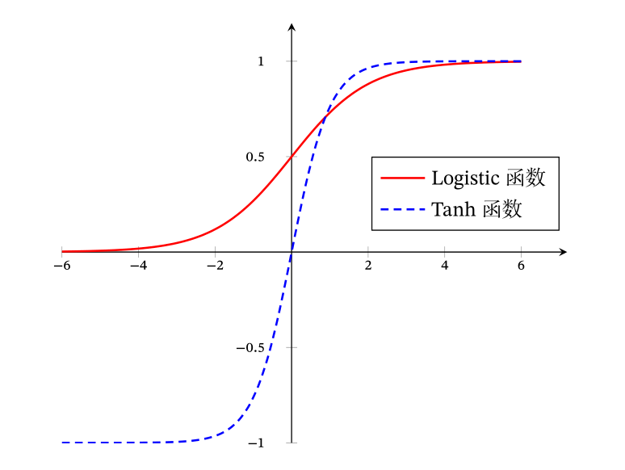

-
- `Sigmoid` 函数指的是 S 型，且两端饱和的函数，常用的 Sigmoid 函数包括 Logistic 函数和 Tanh 函数。
-
- ## Logistic 函数
- **定义**(Logistic 函数). 称函数 $\sigma: \mathbb{R} \rightarrow \mathbb{R}$
  
  $$ \sigma(x) = \frac{1}{1+e^{-x}} $$
  
  为 Logistic 函数，满足值域处于 $[0,1]$ 之间。
- {:height 322, :width 391}
- **注.** 当需要值域 $[0,c]$，拐点为 $-b/w$ 时，会使用
  
  $$ c \cdot \sigma(b + wx) = \frac{c}{1 + e^{-(b + wx)}} $$
  
  且 $w$ 越大越陡峭。
-
- ## Tanh 函数
- **定义**(Tanh 函数). Tanh 函数定义为
  
  $$ \mathrm{tanh}(x) = \frac{e^x - e^{-x}}{e^x + e^{-x}} $$
- {:height 284, :width 361}
-
-