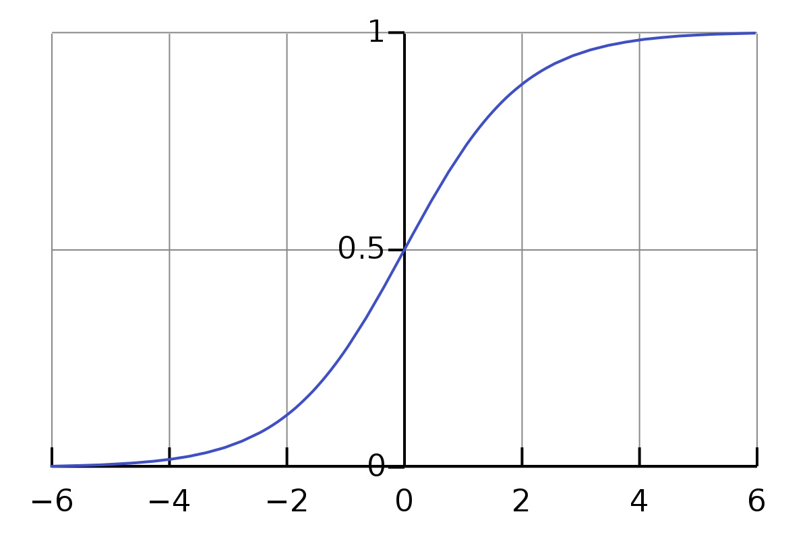

-
- **定义**(Logistic 函数). 称函数 $\sigma: \mathbb{R} \rightarrow \mathbb{R}$
  
  $$ \sigma(x) = \frac{1}{1+e^{-x}} $$
  
  为 Logistic 函数，满足值域处于 $[0,1]$ 之间。
- {:height 322, :width 391}
- **注.** 当需要值域 $[0,c]$，拐点为 $-b/w$ 时，会使用
  
  $$ c \cdot \sigma(b + wx) = \frac{c}{1 + e^{-(b + wx)}} $$
  
  且 $w$ 越大越陡峭。
-
-