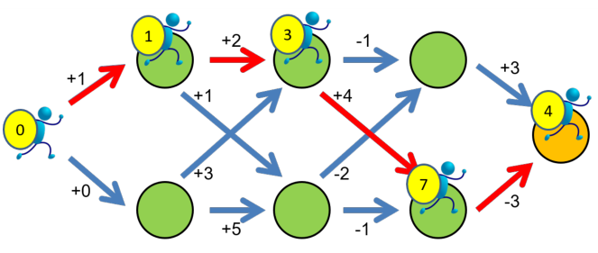

-
- 动态规划（Dynamic Programming）是一种经典算法，其将复杂的原问题拆分为相对简单的子问题，并根据子问题的解求解出原问题的解。
-
- ## 简单的例子
- 根据下图说明小人如何选择路径可以得分最高
  
  
- 思路：看似只能遍历，但是遍历的代价太大了。实际可以算出每个位置的最优得分，往前递推推出前面位置的最优得分，下面记号 $(V,C)$ 表示列与行：
	- 第四列：$(4,1)$ 位置最高 $3$，$(4,2)$ 位置最高 $-3$。
	- 第三列：$(3,1)$ 位置最高 $2$（选择 $(4,1)$），$(3,2)$ 位置最高 $1$。
	- 第二列：$(2,1)$ 位置最高 $4$，$(2,2)$ 位置最高 $6$。
	- 第一列：最高 $6$。
-
- ## 更多例子
-
-
-
-
-
