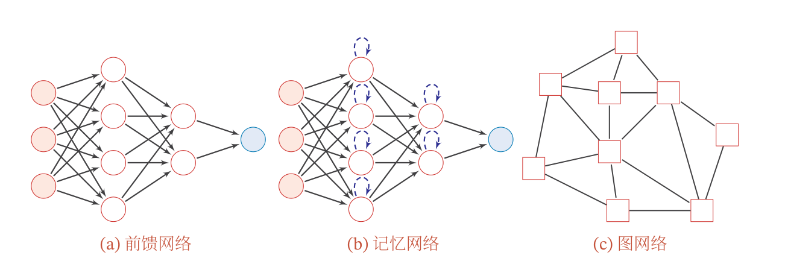

-
- ## 资料
- 李宏毅课程：[李宏毅机器学习课程主页](https://speech.ee.ntu.edu.tw/~hylee/ml/2022-spring.php)，作业见 [[李宏毅机器学习课程笔记]]。
-
-
-
- ## 神经网络的基本构成
- 神经网络由多层组成，每层包括多个神经元（节点），常见的网络包括 [[前馈网络]]、[[记忆网络]]、[[图网络]]、[[循环神经网络]]、[[残差网络]]。
- {:height 268, :width 782}
- **定义**(神经元). 神经元接收 $D$ 个输入 $x_1,\cdots, x_D$，用 $z = \sum_{d = 1}^D w_dx_d+b = \mathbf{w}^T\mathbf{x} + \mathbf{b}$ 表示输入的加权和，$f$ 是一个非线性函数（称为 Activation Function），神经元输出 Activation
  
  $$ a = f(z). $$
- 权重 $\mathbf{w}$ ：权重反映出连接不同神经元的参数，表示信号的传递强度。
- Activation Function 的选择： [[Sigmoid 函数]]、
-
- ## 常用网络模型
- [[卷积神经网络 CNN]]：`CNN` 是主要用于图像处理的神经网络
-
-
-
-